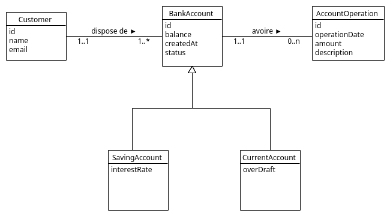

## Introduction

Application d'une ''mini'' banque digitale

## Class diagramme (Entités)

## API , end points

### Customer

- **GET   /customers :**            lister tous les client
- **GET   /customers/search :**     cherche un client par nom
- **GET   /customers/{id} :**       Retouner la liste des clients
- **POST  /customers :**            Ajouter un client
- **PUT   /customers/{id} :**       Modifier les information d'un client
- **DEL   /customers/{id} :**       Supprimer un client est tous les compts relatives

### Bank Account

- **GET   /accounts:**                      lister tous les comptes
- **GET   /accounts/{id}:**                 Retourner un compte
- **GET   /accounts/{customerId}/bankAccounts:** retouner les compte banquaire d'un client
- **GET   /accounts/{id}/operations:**      Historique d'un compte
- **GET   /accounts/{id}/pageOperations**   Historique d'un compte avec pagination
- **POST  /accounts/debit**                 Créditer un compte
- **POST  /accounts/credit**                Débiter un compte
- **POST  /accounts/transfer**              Transferer l'argent depuis/vers un compte
